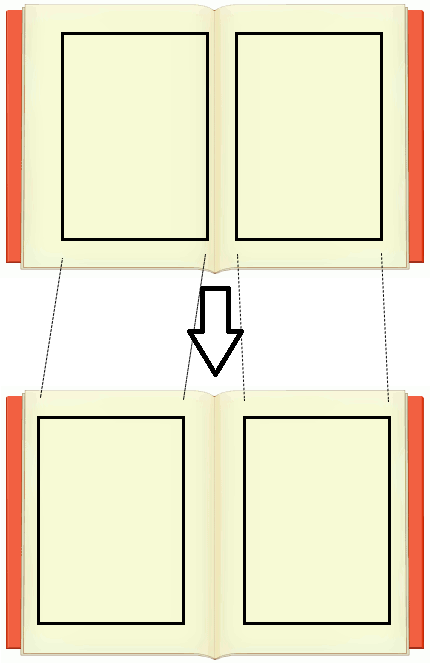

# pdfoffset

把PDF文件的页面向左或右平移，打印PDF成纸质书时防止内容卡在中间。

Offset pdf pages to left and right, useful when printing a paper book.

## 功能 Basic Idea

## 使用 Usage
下载pdfoffset.exe，双击即可运行。

Download and run pdfoffset.exe. 

## 帮助 Help
PDF打印纸质书的时候，内容常常会挤在书缝里。
这个小程序把奇数页向右平移给定的距离，
把偶数页向左平移给定的距离，来让出装订空间。
平移距离可以是负数，代表反方向平移。
输出文件与输入文件在同一目录下，名字为
输入文件名.offset.pdf。

Offset pdf pages to make room for paper book binding.
Odd pages to right, even pages to left.
The offsets can be negative.
The output is in the same folder as the input, with
.offset.pdf appended.

## 编译 Building
依赖 Dependencies：

* QPDF: https://github.com/qpdf/qpdf
* FLTK: https://github.com/fltk/fltk

QPDF needs zlib and turbo-jpeg/libjpeg.
